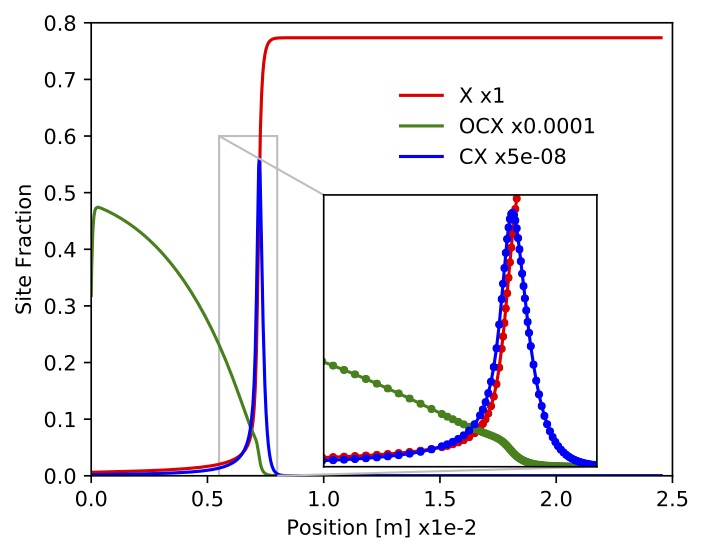
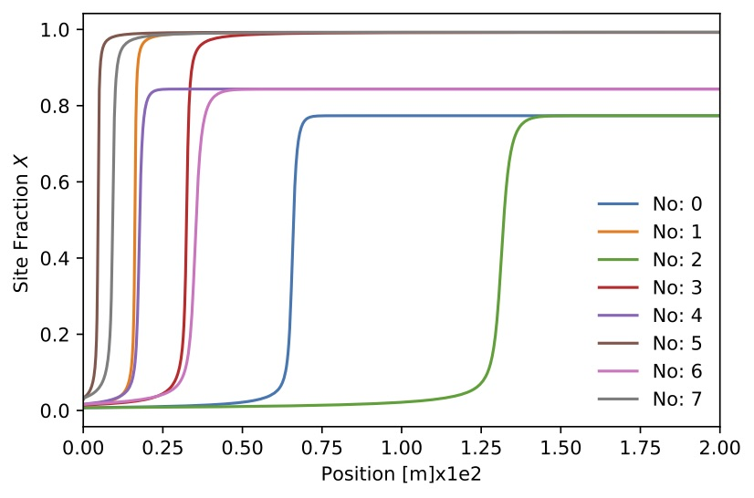
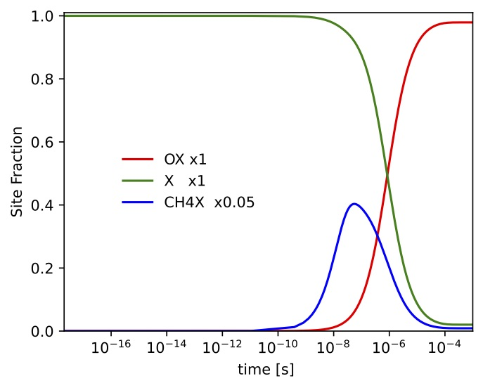

# [Plug Flow Reactor (PFR) Model with Gas-Phase and Surface Reactions](#cxx-api-PlugFlowReactor)

<!-- ## Problem Definition -->

The plug flow reactor (PFR) example employs both gas-phase and surface species. The PFR is assumed to be in steady state, and it is modeled by a system of differential-algebraic equations (DAE). The ODE part of the problem corresponds to energy, momentum, total mass, and species mass balance equations. The algebraic constraint arises from the assumption that the PFR problem is a steady-state problem. Thus, the composition on the wall surface must be stationary.

The equations for the species mass fractions $Y_k$, temperature $T$, axial velocity $u$, and continuity (represented by density $\rho$) resolved by TChem were derived from

* Robert J. Kee, Michael E. Coltrin, Peter Glarborg, Huayang Zhu, "Chemically Reacting Flow: Theory, Modeling, and Simulation, Second Edition."


* ***Species equation***

$$
\frac{ d  Y_k }{dz}  =  \frac{1 }{\rho u}\dot{w_{k}}W_k + \frac{ P_r^{'} }{\rho u A_c} \dot{s}_kW_k - \frac{ P_r^{'}}{\rho u A_c}Y_k \sum_{k=1}^{Kg} \dot{s}_kW_k
$$

* ***Temperature equation***

$$
\frac{dT}{dz} =  - \frac{1}{\rho u c_p}  \sum_{k=1}^{Kg} \dot{w_{k}} W_k h_k - \frac{P_r^{'}}{ \rho u A_c c_p}\sum_{k=1}^{Kg}\dot{s}_kW_k h_k
$$

* ***Velocity equation***

$$
\frac{ d  u }{dz} =  -\gamma \frac{ P_r^{'} }{\rho A_c} \sum_{k=1}^{Kg}\dot{s}_kW_k   - \frac{ R }{u\, m}\big ( \frac{ 1 }{\bar{W}} \frac{dT}{dz} +    T \sum _{k=1}^{Kg} \frac{d Y_k}{ dz}\frac{1}{W_k} \big )
$$

* ***Density equation***

$$
\frac{d \rho }{ dz} =  \frac{P_r^{'}}{u A_c} \sum_{k=1}^{Kg} \dot{s}_kW_k   - \frac{\rho}{u } \frac{du}{dz}
$$

where $\gamma=\frac{1+\frac{p}{\rho u^2} }{1-\frac{p}{\rho u^2}}$, $m=1 - \frac{p}{\rho u^2}$, $A_c$ is the surface area, $P_r$' is the surface chemistry parameter. In the equations above $\dot{s}_k$ represents the surface chemistry production rate for a gas-phase species $k$.

* ***Algebraic constraint***
$$
\dot{s}_k = 0, \quad  k \text{ correspond to surfaces species }
$$

Here $N_{spec}^s$ represents all surface species.

The number of ODEs is equal to the number of gas-phases species with three additional equations for density, velocity, and thermodynamic temperature. The number of constraints is equal to the number of surface species. This PFR formulation assumes that surface reactions are taking place on the channel wall and gas-phase reactions inside the channel. Wall friction and heat transfer at the wall are neglected in this example.
## Jacobian of RHS

TChem uses either a numerical Jacobian based on a forward finite differences scheme or an analytical Jacobian based on AD via the [SACADO library](https://docs.trilinos.org/dev/packages/sacado/doc/html/index.html). To choose between numerical and analytical Jacobian, set the following cmake flag on TChem's configuration at compilation time.
```
-D TCHEM_ENABLE_SACADO_JACOBIAN_PLUG_FLOW_REACTOR
```
The default value of this flag is "OFF", which means by default the numerical Jacobian is used by DAE solver.

## Running the Plug Flow Reactor with Surface Reactions Utility

The executable for this example is installed under ``TCHEM_INSTALL_PATH/example``. The inputs for this example are obtained through:

```
Usage: ./TChem_PlugFlowReactor.x [options]
  options:
  --atol-newton                 double    Absolute tolerance used in newton solver
                                          (default: --atol-newton=1.000000000000000e-14)
  --atol-z                      double    Absolute tolerence used for adaptive time stepping
                                          (default: --atol-z=1.000000000000000e-12)
  --batchsize                   int       Batchsize the same state vector described in statefile is cloned
                                          (default: --batchsize=1)
  --catalytic-perimeter         double    Chemically active perimeter [m],
                                          (default: --catalytic-perimeter=2.597723924341531e-02)
  --chemfile                    string    Chem file name e.g., chem.inp
                                          (default: --chemfile=data/plug-flow-reactor/CH4-PTnogas/chem.inp)
  --dzmax                       double    Maximum dz step size [m]
                                          (default: --dzmax=1.000000000000000e-03)
  --dzmin                       double    Minimum dz step size [m]
                                          (default: --dzmin=9.999999999999999e-21)
  --echo-command-line           bool      Echo the command-line but continue as normal
  --help                        bool      Print this help message
  --initial-condition           bool      If true, use a newton solver to obtain initial condition of the constraint
                                          (default: --initial-condition=false)
  --inputs-path                 string    prefixPath e.g.,inputs/
                                          (default: --inputs-path=data/plug-flow-reactor/CH4-PTnogas/)
  --jacobian-interval           int       Jacobians evaluated once in this interval
                                          (default: --jacobian-interval=1)
  --max-newton-iterations       int       Maximum number of newton iterations
                                          (default: --max-newton-iterations=20)
  --max-z-iterations            int       Maximum number of z iterations
                                          (default: --max-z-iterations=4000)
  --outputfile                  string    Output file name e.g., PFRSolution.dat
                                          (default: --outputfile=PFRSolution.dat)
  --reactor-area                double    Cross-sectional Area [m2]
                                          (default: --reactor-area=5.300000000000000e-04)
  --rtol-newton                 double    Relative tolerance used in newton solver
                                          (default: --rtol-newton=1.000000000000000e-08)
  --samplefile                  string    Input state file name e.g., input.dat
                                          (default: --samplefile=data/plug-flow-reactor/CH4-PTnogas/sample.dat)
  --surf-chemfile               string    Chem file name e.g., chemSurf.inp
                                          (default: --surf-chemfile=data/plug-flow-reactor/CH4-PTnogas/chemSurf.inp)
  --surf-inputfile              string    Input state file name e.g., inputSurfGas.dat
                                          (default: --surf-inputfile=data/plug-flow-reactor/CH4-PTnogas/inputSurf.dat)
  --surf-thermfile              string    Therm file name e.g.,thermSurf.dat
                                          (default: --surf-thermfile=data/plug-flow-reactor/CH4-PTnogas/thermSurf.dat)
  --team-size                   int       User defined team size
                                          (default: --team-size=-1)
  --thermfile                   string    Therm file name e.g., therm.dat
                                          (default: --thermfile=data/plug-flow-reactor/CH4-PTnogas/therm.dat)
  --time-iterations-per-intervalint       Number of time iterations per interval to store qoi
                                          (default: --time-iterations-per-interval=10)
  --tol-z                       double    Tolerance used for adaptive z stepping [m]
                                          (default: --tol-z=1.000000000000000e-08)
  --transient-initial-condition bool      If true, use a transient solver to obtain initial condition of the constraint
                                          (default: --transient-initial-condition=true)
  --use-prefix-path             bool      If true, input file are at the prefix path
                                          (default: --use-prefix-path=false)
  --vector-size                 int       User defined vector size
                                          (default: --vector-size=-1)
  --velocity-inputfile          string    Input state file name e.g., inputVelocity.dat
                                          (default: --velocity-inputfile=data/plug-flow-reactor/CH4-PTnogas/inputVelocity.dat)
  --verbose                     bool      If true, printout the first Jacobian values
                                          (default: --verbose=true)
  --zbeg                        double    Position begin [m]
                                          (default: --zbeg=0.000000000000000e+00)
  --zend                        double    Position end [m]
                                          (default: --zend=2.500000000000000e-02)
Description:
  This example computes Temperature, density, mass fraction and site fraction for a plug flow reactor
```

The following shell script sets the input parameters and runs the PFR example

```
exec=$TCHEM_INSTALL_PATH/example/TChem_PlugFlowReactor.x
inputs=$TCHEM_INSTALL_PATH/example/data/plug-flow-reactor/CH4-PTnogas/

run_this="$exec --inputs-path=$inputs \
                --initial-condition=false \
                --use-prefix-path=true \
                --transient-initial-condition=true \
                --reactor-area=0.00053 \
                --catalytic-perimeter=0.025977239243415308 \
                --max-newton-iterations=20 \
                --atol-newton=1e-18 \
                --rtol-newton=1e-8 \
                --tol-z=1e-8 \
                --dzmin=1e-20 \
                --dzmax=1e-3 \
                --zend=0.025 \
                --max-z-iterations=310 "

echo $run_this
eval $run_this

```

We ran the example  in the install directory
``TCHEM_INSTALL_PATH/example/runs/PlugFlowReactor/CH4-PTnogas``.
Thus, all the paths are relative to this directory. This script will run the executable ``TCHEM_INSTALL_PATH/example/TChem_PlugFlowReactor.x`` with the input files located at
``TCHEM_INSTALL_PATH/example/data/plug-flow-reactor/CH4-PTnogas/``. These files correspond to the gas-phase and surface reaction mechanisms (``chem.inp`` and ``chemSurf.inp``) and their corresponding thermodynamic properties files (``therm.dat`` and ``thermSurf.dat``).  The operating condition at the inlet of the reactor, i.e. the gas composition, in ``sample.dat``, and the initial guess for the site fractions, in ``inputSurf.dat``, are also required. The format and description of these files are presented in [Section](#inputfiles). The gas velocity at the inlet is provided in ``inputVelocity.dat``.

The "reactor-area" [$m^2$] is the cross area of the channel and "catalytic-perimeter" [$m$] is the chemical active perimeter of the PFR.  The step size is controlled by  "dzmin",  "dzmax", and "tol-z"; the simulation will end when "z" (position) is equal to  "zend" or when the number of iterations reaches "max-z-iterations".  The relative and absolute tolerance in the Newton solver are set through "atol-newton" and "rtol-newton". The description of the numerical time integration method can be found in [Tines]'(https://github.com/sandialabs/tines) documentation. The solution profiles will be saved in "PFRSolution.dat". The following header is saved in the output file.


```
iter     t       dt      Density[kg/m3]          Pressure[Pascal]        Temperature[K] SPECIES1 (Mass Fraction) ... SPECIESN (Mass Fraction)  SURFACE_SPECIES1 (Site Fraction) ... SURFACE_SPECIESN (Site Fraction) Velocity[m/s]  
```

Parameters "transient-initial-condition" and "initial-condition" allow us to pick a method to compute an initial condition that satisfies the system of DAE equation as described in [Section](#initialconditionforpfrproblem). In this case, the simulation will use a transient solver to find an initial surface site fraction to meet the constraint presented above.

***Results***

The gas-phase and surface mechanisms used in this example represent the catalytic combustion of methane on platinum and was developed by [Blondal and co-workers](https://pubs.acs.org/doi/10.1021/acs.iecr.9b01464). These mechanisms have 15 gas species, 20 surface species, 47 surface reactions and no gas-phase reactions. The total number of ODEs is $18$ and there are $20$ constraints.  One simulation took about 12s to complete on a MacBook Pro with a 3.1GHz Intel Core i7 processor. Time profiles for temperature, density, velocity, mass fractions and site fractions for selected species are presented in the following figures.  Scripts and jupyter notebooks for this example are located under "TCHEM_INSTALL_PATH/example/runs/PlugFlowReactor/CH4-PTnogas".


Figure. Gas temperature (left axis), velocity, and density (both on right axis) along the PFR.   


Figure. Mass fraction of $\mathrm{CH}_4$, $\mathrm{OH}$ and $\mathrm{CH}_3\mathrm{OH}$.   


Figure. Mass fractions for $\mathrm{O}_2$, $\mathrm{HCO}$ and $\mathrm{CH}_3\mathrm{OO}$


Figure. Site fractions for $\mathrm{X}$ (empty space), $\mathrm{CH_4X}$ and $\mathrm{OHX}$.


Figure. Site fractions for $\mathrm{OX}$, $\mathrm{CHX}$, $\mathrm{CHOX}$.

One of the most relevant features of the position profiles of the PFR is the temperature profile. In this simulation, temperature is not constant, and can increase significantly from the reactor inlet to its outlet (approximately 800 K), which is typical in combustion simulation. Note that, the profiles along the PFR shown in this figure are similar to the ones obtained by [Blondal and co-workers](https://pubs.acs.org/doi/10.1021/acs.iecr.9b01464) for a slightly different problem setup. However, having a significant temperature gradient in the reactor could cause significant structural issues, e.g., the reactor will require a special material to handle high temperature gradients. Thus, to find a possible solution, one could use TChem to try several operating conditions/reactor designs. For example, increase inlet-gas velocity as we will present below in the parametric study, or reduce the reactive length of the reactor. Because the computational expense of a PFR-TChem simulation is considerably smaller than high-fidelity 3D simulations, one could test multiple reactor designs and operating conditions with TChem to find an approximate optimal operation condition and reactor design.   

***Parametric study***

The executable "TCHEM_INSTALL_PATH/example/TChem_PlugFlowReactor.x" can be also used with more than one sample. In this example, we ran it with eight samples. The inputs for this run are located at "TCHEM_INSTALL_PATH/example/data/plug-flow-reactor/CH4-PTnogas_SA". A script and a jupyter-notebook to reproduce this example are placed under "TCHEM_INSTALL_PATH/example/runs/PlugFlowReactor/CH4-PTnogas_SA".

These samples correspond to combination of values for the molar fraction of  $CH_4$, $\{0.04,0.08\}$, inlet gas temperature, $\{800,9000\}$ [K], and velocity, $\{0.0019,0.0038\}$ [m/s]. The bash script to run this problem is listed below

The bash script to run this problem is :

```
exec=$TCHEM_INSTALL_PATH/example/TChem_PlugFlowReactor.x
mech=$TCHEM_INSTALL_PATH/example/data/plug-flow-reactor/CH4-PTnogas

run_this="$exec --chemfile=$mech/chem.inp \
                --thermfile=$mech/therm.dat \
                --samplefile=inputs/sample.dat \
                --surf-chemfile=$mech/chemSurf.inp \
                --surf-thermfile=$mech/thermSurf.dat \
                --surf-inputfile=inputs/inputSurf.dat \
                --velocity-inputfile=inputs/inputVelocity.dat \
                --use-prefix-path=false \
                --outputfile=PFRSolution.dat \
                --initial-condition=false \
                --transient-initial-condition=true \
                --reactor-area=0.00053 \
                --catalytic-perimeter=0.025977239243415308 \
                --max-newton-iterations=20 \
                --atol-newton=1e-16 \
                --rtol-newton=1e-6 \
                --tol-z=1e-6 \
                --dzmin=1e-30 \
                --dzmax=1e-3 \
                --zend=0.025 \
                --max-z-iterations=400 "

echo $run_this
eval $run_this
```

In the above script we did not use a prefix path ("use-prefix-path=false") instead we provided the name of the inputs files: "chemfile", "thermfile",  "chemSurffile", "thermSurffile", "samplefile", "inputSurffile", "inputVelocityfile". The files for the reaction mechanism ("chem.inp" and "chemSurf.inp") and the thermo files ("therm.dat" and "thermSurf.dat") are located under "TCHEM_INSTALL_PATH/example/data/plug-flow-reactor/CH4-PTnogas/". The files with the inlet conditions ("sample.dat", "inputSurf.dat", and "inputVelocity.dat") are located in the "input" directory, located under the run directory. One can set a different path for the input files with the command-line option "use-prefix-path". Additionally, one can also use the option "transient-initial-condition=true", to activate the transient solver to find initial condition for the [PFR](#initialconditionforpfrproblem).


The following figures show temperature, gas-phase species mass fractions and surface species site fractions corresponding to the example presented above.


Figure. Gas temperature for all samples.


Figure. Mass fraction of $O_2$ for all samples.


Figure. Mass fraction of $CH_4$ for all samples.


Figure. Mass fraction of $CO$ for all samples.


Figure. Mass fraction of $OH$ for all samples.


Figure. Site fraction of $X$ for all samples.


Figure. Site fraction of $OX$ for all samples.


Figure. Site fraction of $CH_4X$ for all samples.

## Initial Condition for PFR Problem

The initial condition for the PFR problem must satisfy the algebraic constraints in the DAE system. To ensure consistency, TChem first solves a system that accounts for the constraints only. The gas-phase species mass fractions and temperature are kept constant. The constraint component can be solved either by evolving an equivalent time-dependent formulation to steady-state or by directly solving the non-linear problem directly. In the later approach, a Newton solver is used to solve for the combination of site fractions that satisfy $\dot{s}_k=0$ for all surface species $k$. For the [former approach](#cxx-api-SimpleSurface), the system of equations below is advanced in time until the system reaches a steady state.

$$ \frac{dZ_k}{dt}= \frac{\dot{s}_k}{\Gamma}, \quad  k \text{ correspond to surfaces species } $$


This is presented at "TCHEM_REPOSITORY_PATH/src/example/TChem_SimpleSurface.cpp". The following shows three surface species; all the other species have site fractions less than $10^{-4}$. This result shows the time to reach stable state is approximately $10^{-4}$ s. In the PFR example presented above, this option can be enabled by setting "transient-initial-condition=true" and "initial-condition=false".

 
 Figure.Site fractions for $\mathrm{X}$ (empty space), $\mathrm{OX}$, and $\mathrm{CH4X}$. We start this simulation with an empty surface ($\mathrm{X}=1$).

The example produces an output file ("InitialConditionPFR.dat") with the last iteration. This file can be used in the PFR problem as the "inputSurf.dat" file. The inputs for this example are located at "TCHEM_INSTALL_PATH/example/runs/InitialConditionPFR".

<!-- In the [later approach](#cxx-api-InitialConditionSurface), we employ a Newton solver to find a solution to the algebraic constraints. This is implemented under "TCHEM_REPOSITORY_PATH/src/example/TChem_InitialCondSurface.cpp".  -->

Note that If both "initial-condition" and "transient-initial-condition" are set true, the code will execute the transient initial condition first and then the newton initial condition.
